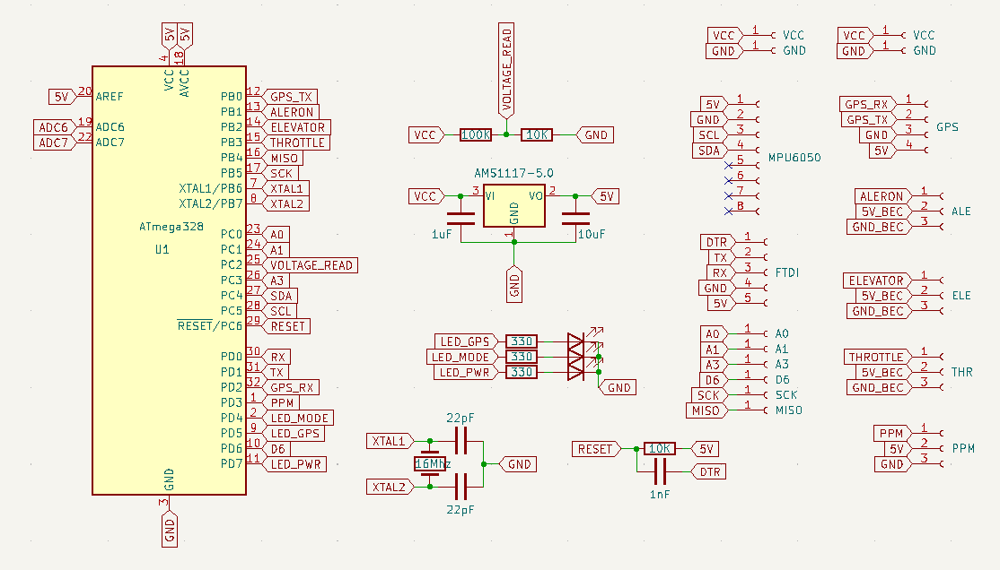
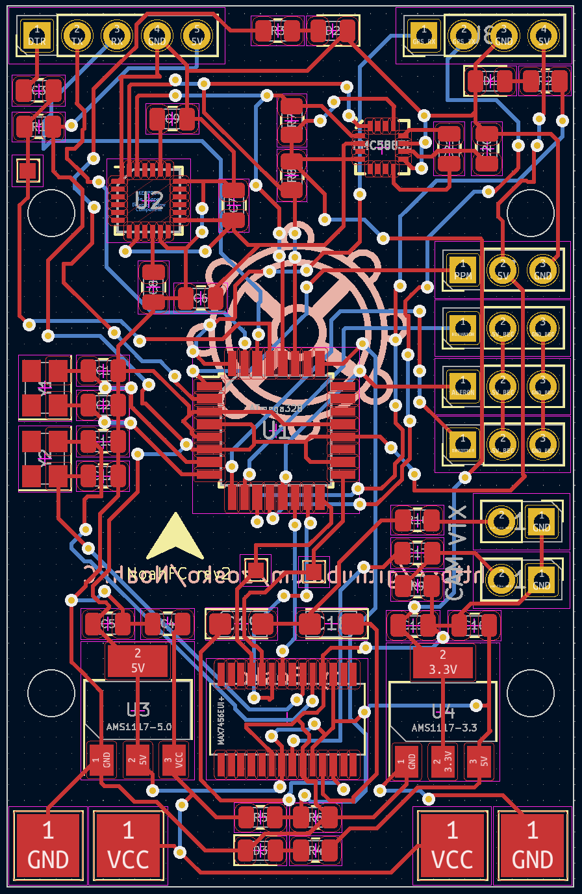
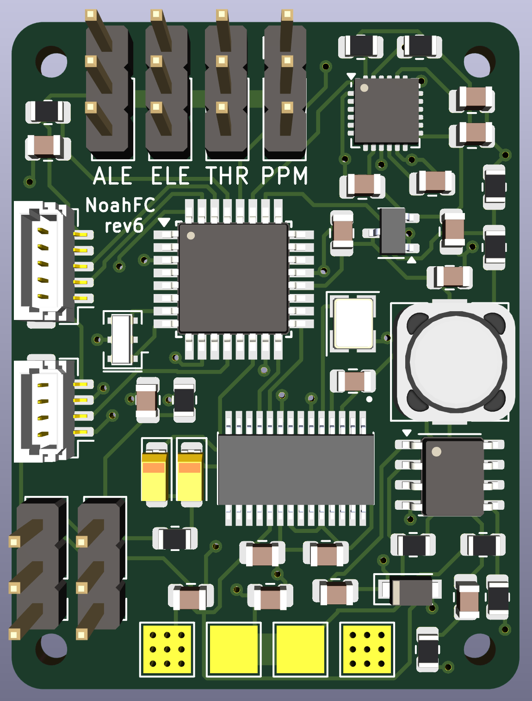

## [warning] - In Development - [warning]

# NoahFC
- Atmega328 based Flight Controller.

### Features
- [X] PPM
- [X] GPS
- [ ] Failsafe
- [X] Manual mode
- [X] Stable mode
- [ ] Return to home
- [X] Low cost

### Used Pins
Arduino | Component
---------|---------
D0| UART (RX)
D1| UART (TX)
D2| GPS RX (interrupt)
D3| PPM Input (interrupt)
D4| LED MODE
D5| LED GPS
D7| LED POWER
D8| GPS TX
D9| Alerons
D10| Elevator
D11| Throttle
A2| Voltage read
SDA| MPU6050
SCL| MPU6050
RST| DTR

### Free Pins
Arduino | Type
---------|---------
A0| Analog pin
A1| Analog pin
A3| Analog pin
D6| PWM Digital pin
D12| Digital pin (MOSI)
D13| Digital pin (SCK) 

## Scheme

## Boards
Board|PCB filled
---------|---------
|

## Panels
Board|PCB filled
---------|---------
|
