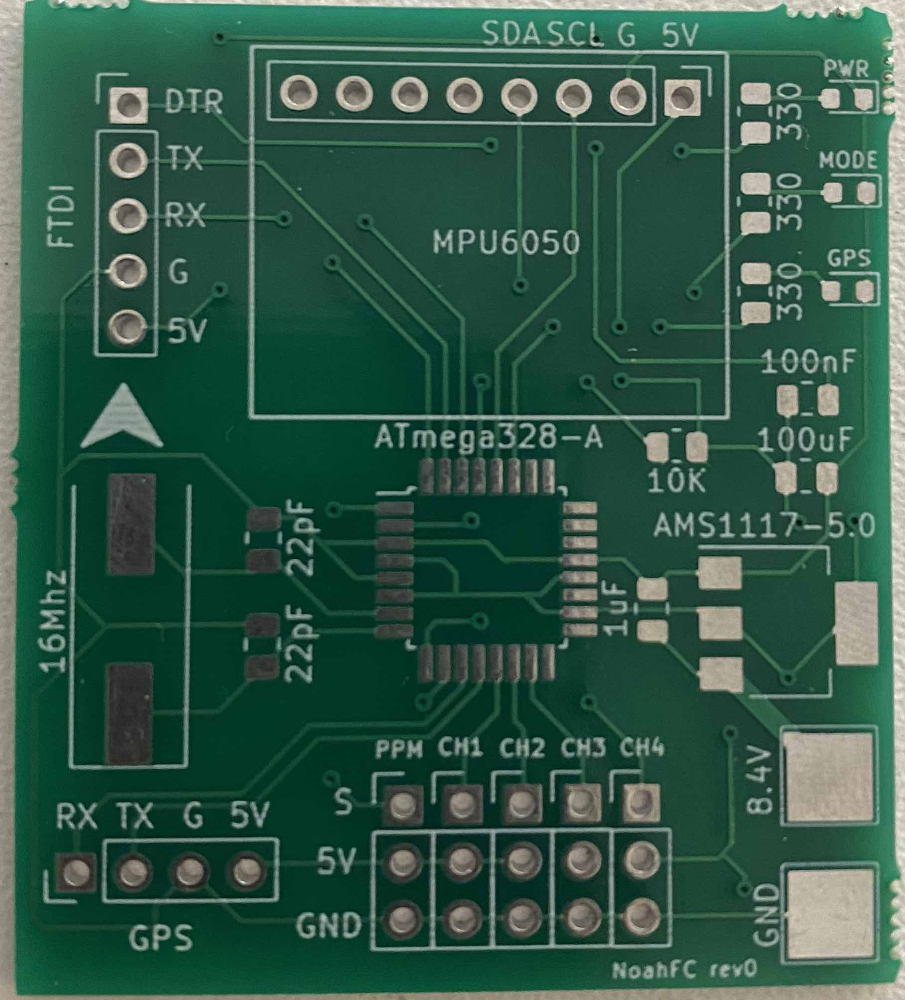
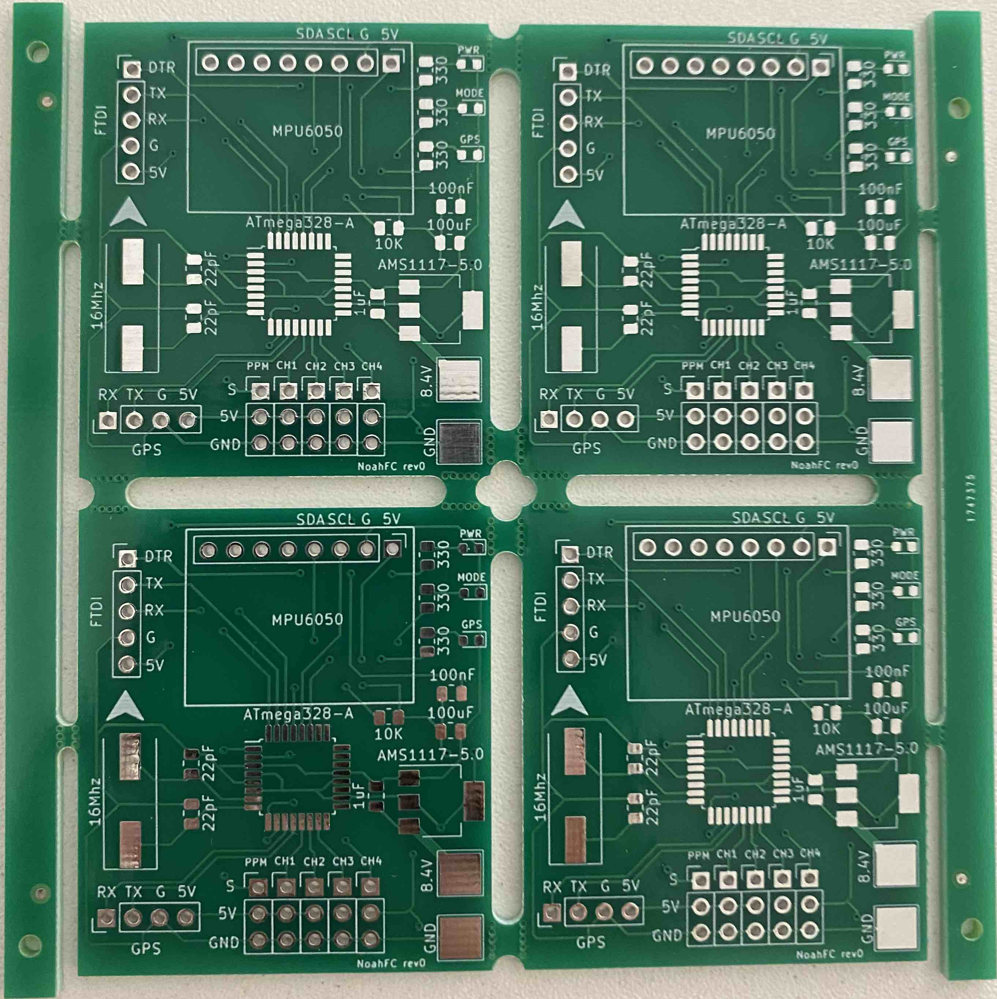

## [warning] - In Development - [warning]

# NoahFC
- Atmega328 based Flight Controller.

### Features
- [X] PPM
- [X] GPS
- [X] Failsafe
- [X] Manual mode
- [X] Stable mode
- [ ] Return to home
- [X] Low cost
- [X] OSD

### Used Pins
Arduino | Component
---------|---------
D0| UART (RX)
D1| UART (TX)
D2| GPS RX (interrupt)
D3| PPM Input (interrupt)
D4| LED MODE
D5| Throttle
D6| Elevator
D7| LED GPS
D8| GPS TX
D9| Alerons
D10| CS (OSD)
D11| MOSI (OSD)
D12| MISO (OSD)
D13| SCK (OSD)
A2| Voltage read
SDA| MPU6050, HMC5883L
SCL| MPU6050, HMC5883L
RST| DTR

## Scheme

## Boards
Board|PCB filled
---------|---------
|

## Panels
Board|PCB filled
---------|---------
|

## PCB Design

For PCB design i will use services from SeeedFusion. 

Seeed Fusion PCB Assembly Service offers one-stop prototyping for PCB manufacture, PCB assembly and as a result they produce superior quality PCBs and Fast Turnkey PCBA from 7 working days. When you prototype with Seeed Fusion, they can definitely provide Free DFA and Free functional tests for you! 

Check out their website to know about their manufacturing capabilities and service.
https://www.seeedstudio.com/pcb-assembly.html

Single PCB|Panel PCB
---------|---------
|

## Reasons to choose Seeed Studio
- They provide PCB services at extremely low pricing and with excellent quality.
- Their offer is structured in such a way that everyone may have these boards at a reasonable price.
- They have a highly knowledgeable crew that leads their clients to avail deals and guides them about the costs and rates of different services.
- A four-layer board with a comparable feature costs $5 for 10 pieces and is made in four days.
- SMT stencil with size (10cm x 13cm) is available for $8.00 per piece.

