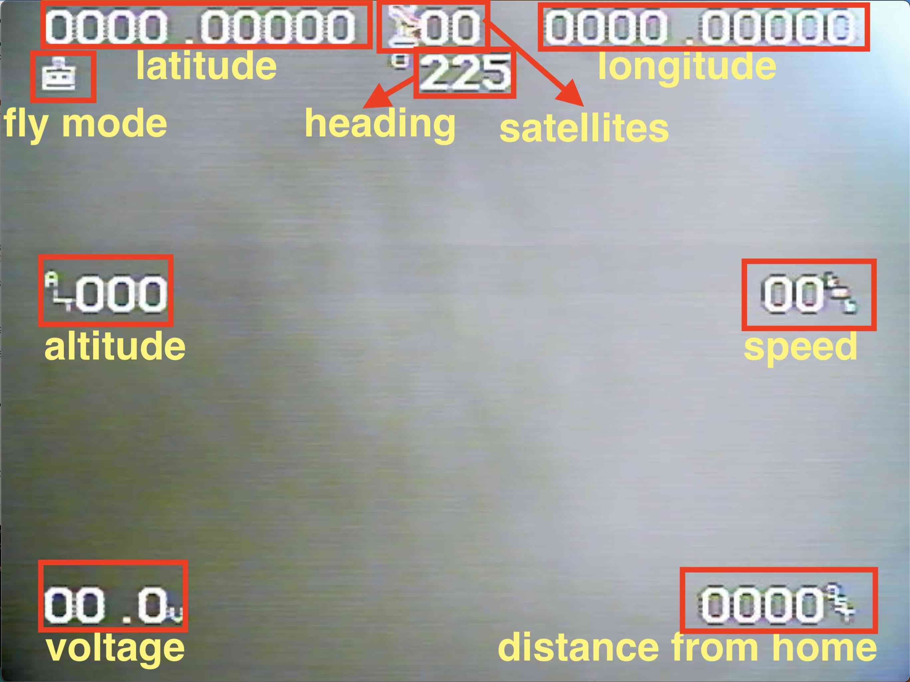

# NoahFC
Open Hardware for Smarter Flight

Modular, open-source flight controller with integrated BEC and ESC designs. Build, customize, and fly freely.

#### Based low cost Atmega328 based Flight Controller with necessary features.

# Electronic used
- Flight Controller - [NoahFC](https://github.com/zosko/NoahFC)
- ESC Controller - [NoahESC](https://github.com/zosko/NoahESC)
- BEC - [NoahBEC](https://github.com/zosko/NoahBEC)
- Receiver - (TBS Nano)
- Plane - (ZOHD Drift)
- Camera
- VTX Transmitter

### Features
- [X] **PPM**
- [X] **GPS**
- [X] **Manual mode**
- [X] **Stable mode**
- [in progress] Return to home
- [X] **OSD**

### Used Pins
Arduino | Component | Arduino | Component
--------|----------|---------|---------
D0| UART RX| D9| Alerons
D1| UART TX| D10 | SS (OSD)
D2| GPS RX | D11 | MOSI (OSD)
D3| PPM Input | D12 | MISO (OSD)
D5| Throttle | D13 | SCK (OSD)
D6| Elevator | SDA | MPU6050
D8| GPS TX | SCL | MPU6050

### Transmitter setup
Channel | Info
-----|-----
CH1 | Elevator
CH2 | Alerons
CH3 | Throttle
CH4 | Take off
CH5 | Modes

### Modes
Channel 5 should be 3-position switch
- Min [**Manual**]
- Mid [**Stable**]
- Max [**RTH**]

### Take off
- Channel 4 should be 2-position switch
- Min [**nothing**]
- Max [**Take Off**]

### Firmware
**Download**: [Firmware](firmware.hex)
```
Sketch uses 23570 bytes (76%) of program storage space. Maximum is 30720 bytes.
Global variables use 1185 bytes (57%) of dynamic memory, leaving 863 bytes for local variables. Maximum is 2048 bytes.
```
**Installation**:
`avrdude -p m328 -c arduino -P /dev/ttyUSB0 -b 115200 -F -U flash:w:firmware.hex`

## OSD


## Scheme


## Boards Preview
Board|PCB
---------|---------
|

## Sponsorship


**This project is proudly sponsored by [PCBWay](https://pcbway.com).**

PCBWay specializes in manufacturing high-quality printed circuit boards (PCBs), making them accessible and affordable for both hobbyists and professionals.

Their range of services includes:

- PCB prototyping
- Assembly services
- Instant order quotations
- Expert verification processes
- A user-friendly, hassle-free ordering system

I'm sincerely grateful to PCBWay for their generous support in making this project possible.
