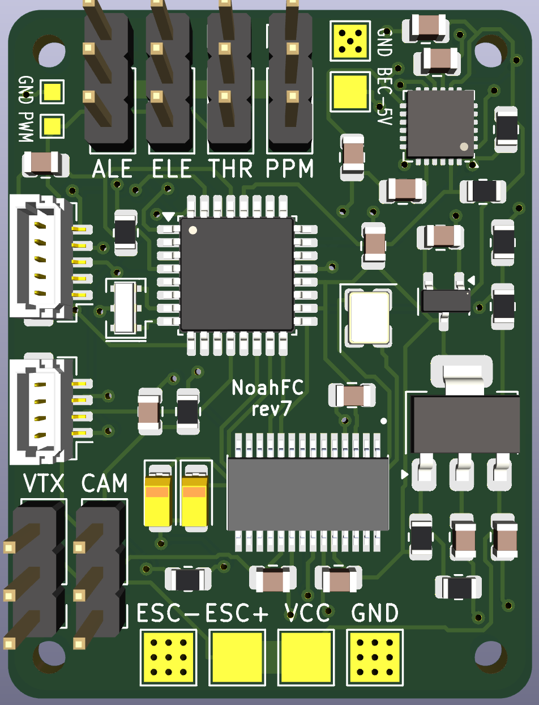

## [warning] - In Development - [warning]

# NoahFC
- Atmega328 based Flight Controller for fixed wings.

### Features
- [ ] PPM
- [ ] Failsafe
- [ ] Manual mode
- [ ] Stabilization mode
- [ ] Return to home
- [ ] Low cost
- [ ] First testflight

### Components
- [X] GPS
- [X] Stabilization
- [X] PPM Input
- [ ] Voltage Read

### Pins
Arduino | Component
---------|---------
D2| PPM Input (interrupt)
D3| NeoSWSerial (GPS) RX
D4| NeoSWSerial (GPS) TX
D6| ESC Controller
SDA| MPU6050
SCL| MPU6050
D9| Left Wing Servo
D10| Right Wing Servo
D11| Elevator Servo
A2| Voltage read

## Scheme

## Boards
Board|PCB filled
---------|---------
|

## Panels
Board|PCB filled
---------|---------
|
