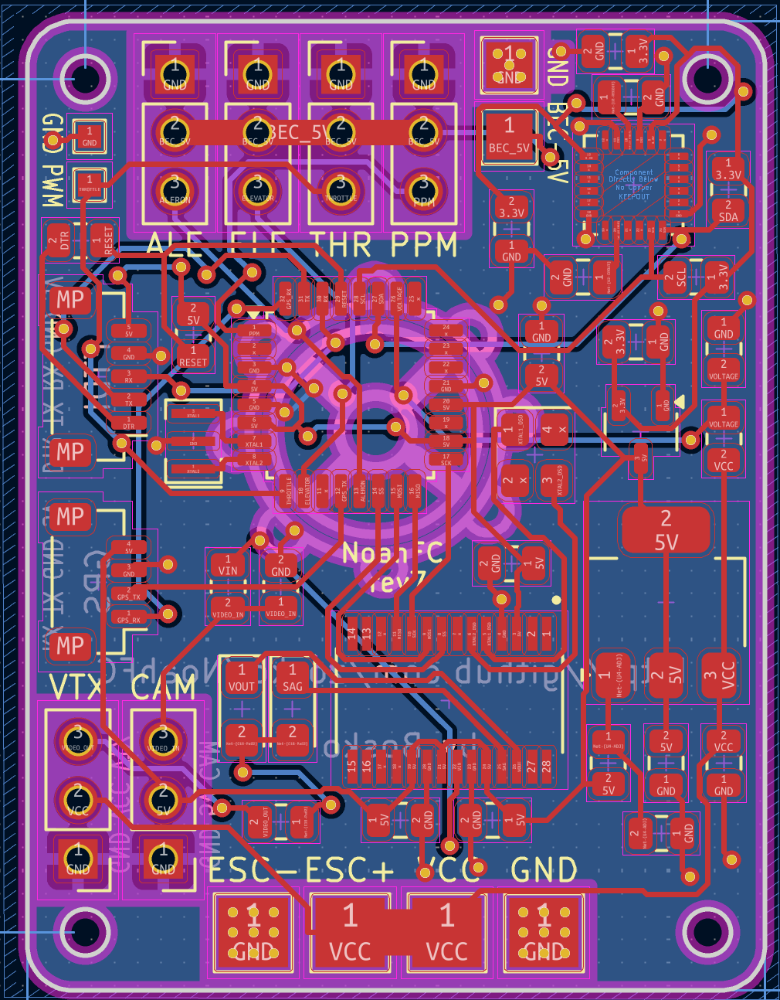

# [warning] - In Development - [warning]

# NoahFC
- Atmega328 based Flight Controller for fixed wings.

### Features
- [ ] PPM
- [ ] Manual mode
- [ ] Stabilization mode
- [ ] Return to home
- [X] Low cost
- [ ] First testflight

## Scheme

## Boards
Board|PCB filled
---------|---------
|

## Panels
Board|PCB filled
---------|---------
|
