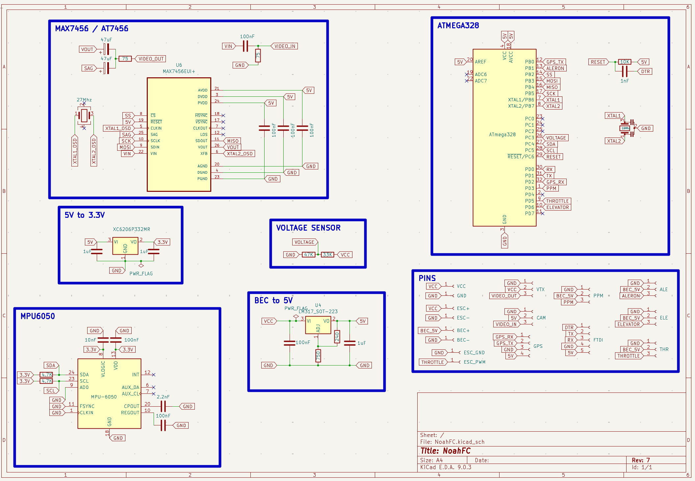

## [warning] - In Development

# NoahFC
- Trying to make low cost Atmega328 based Flight Controller with necessary features.

# Testing on
- [X] ZOHD Drift
- [ ] Wing

### Features
- [X] **PPM**
- [X] **GPS**
- [ ] Failsafe
- [X] **Manual mode**
- [X] **Stable mode**
- [ ] Return to home
- [X] **OSD**

### Used Pins
Arduino | Component| | Arduino | Component
---------|---------|---------|---------|---------
D0| UART RX||D9| Alerons
D1| UART TX||D10| SS (OSD)
D2| GPS RX (interrupt)||D11| MOSI (OSD)
D3| PPM Input (interrupt)||D12| MISO (OSD)
D4| LED MODE||D13| SCK (OSD)
D5| Throttle||SDA| MPU6050
D6| Elevator||SCL| MPU6050
D8| GPS TX||RST| DTR

### Transmitter setup
Channel | Info
-----|-----
CH1 | Elevator
CH2 | Alerons
CH3 | Throttle
CH4 | N/A
CH5 | Modes

### Modes
Channel 5 should be 3-position switch
- Min [**Manual**]
- Mid [**Stable**]
- Max [**RTH**]

### Leds
- Blue blink when GPS signal received
- Yellow lights when is in stable / rth mode

### Firmware
**Download**: [Firmware](firmware.hex)
```
Sketch uses 23196 bytes (75%) of program storage space. Maximum is 30720 bytes.
Global variables use 1077 bytes (52%) of dynamic memory, leaving 971 bytes for local variables. Maximum is 2048 bytes.
```
**Installation**:
`avrdude -p m328 -c arduino -P /dev/ttyUSB0 -b 115200 -F -U flash:w:firmware.hex`

## OSD


## Scheme


## Boards Preview
Board|PCB
---------|---------
|

## Sponsorship


**This project is proudly sponsored by [PCBWay](https://pcbway.com).**

PCBWay specializes in manufacturing high-quality printed circuit boards (PCBs), making them accessible and affordable for both hobbyists and professionals.

Their range of services includes:

- PCB prototyping
- Assembly services
- Instant order quotations
- Expert verification processes
- A user-friendly, hassle-free ordering system

I'm sincerely grateful to PCBWay for their generous support in making this project possible.
